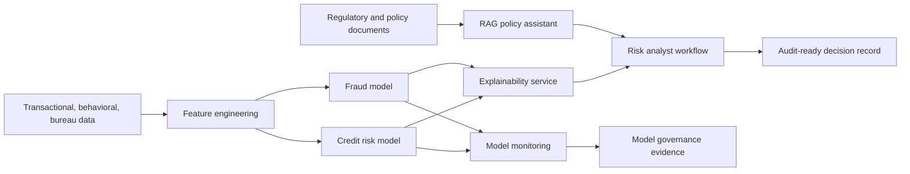

# Credit Risk & Fraud Detection Platform

A portfolio-ready platform that combines credit risk scoring, fraud detection, explainability, model monitoring, and a citation-backed regulatory policy assistant for risk and compliance teams.

This repository uses synthetic data and sample policy text so it can be shared publicly without exposing customer, bureau, transactional, or internal regulatory data.

## What This Project Shows

- Credit default risk scoring using tabular behavioral, bureau, and transaction features.
- Fraud detection over behavioral and transactional signals.
- SHAP-ready explainability for model outputs, with a deterministic fallback when SHAP is not installed.
- Drift monitoring for production stability and model risk governance.
- Regulatory and policy assistant using local retrieval with citation-backed answers.
- MLflow-ready experiment logging hooks for model lifecycle management.
- Documentation for business requirements, architecture, governance, and GitHub publishing.

## Business Problem

Risk teams need faster, explainable, and audit-ready decisions across credit underwriting, portfolio monitoring, and fraud operations. Traditional workflows often require manual document review, fragmented model evidence, and slow investigation handoffs. This platform demonstrates how machine learning and a controlled LLM/RAG assistant can improve analyst speed while preserving traceability.

## Repository Layout

```text
.
+-- app/
|   +-- streamlit_app.py
+-- config/
|   +-- app_config.yaml
+-- data/
|   +-- regulations/
+-- docs/
|   +-- BUSINESS_ARCHITECTURE.md
|   +-- BUSINESS_REQUIREMENTS.md
|   +-- GITHUB_PUSH_GUIDE.md
|   +-- MODEL_GOVERNANCE.md
+-- src/
|   +-- credit_risk_platform/
|       +-- data/
|       +-- explainability/
|       +-- lifecycle/
|       +-- llm/
|       +-- models/
|       +-- monitoring/
|       +-- pipelines/
|       +-- rag/
+-- sql/
|   +-- snowflake_feature_views.sql
+-- tests/
```

## Quick Start

Create a virtual environment and install the lightweight dependencies:

```powershell
python -m venv .venv
.\.venv\Scripts\Activate.ps1
pip install -r requirements.txt
pip install -e .
```

Generate synthetic data:

```powershell
python -m credit_risk_platform.data.make_dataset --rows 5000 --out data/processed/risk_events.csv
```

Train credit risk and fraud models:

```powershell
python -m credit_risk_platform.pipelines.train_models --data data/processed/risk_events.csv --artifacts artifacts
```

Run batch scoring with explanations:

```powershell
python -m credit_risk_platform.pipelines.score_batch --input data/processed/risk_events.csv --artifacts artifacts --output artifacts/scoring/scored_events.csv
```

Ask the regulatory policy assistant a question:

```powershell
python -m credit_risk_platform.rag.policy_assistant --question "What evidence is required for model validation?"
```

Create a drift report:

```powershell
python -m credit_risk_platform.monitoring.drift_report --reference data/processed/risk_events.csv --current data/processed/risk_events.csv --output artifacts/drift/drift_report.json
```

Run tests:

```powershell
pytest
```

## Optional Full Stack Install

For closer alignment with the enterprise stack in the project description:

```powershell
pip install -r requirements-full.txt
```

Optional packages enable XGBoost, SHAP, PyTorch, PySpark, Evidently AI, MLflow, LangChain, Azure OpenAI integration points, and Streamlit.

Optional PySpark feature job:

```powershell
python -m credit_risk_platform.data.spark_feature_pipeline --input data/processed/risk_events.csv --output data/processed/spark_features
```

## Streamlit Web Interface

Run the local web interface:

```powershell
streamlit run app/streamlit_app.py
```

The Streamlit app can generate synthetic data, train the credit and fraud models, score the portfolio, show explanations, simulate drift monitoring, answer policy questions, and export demo outputs.

For Google Colab launch cells, use [Colab Streamlit Guide](docs/COLAB_STREAMLIT_GUIDE.md).

## Architecture Summary



## Public Data Note

The generated dataset is synthetic. The policy files in `data/regulations/` are sample controls written for demonstration, not official legal or regulatory guidance.

## Key Docs

- [Business Requirements](docs/BUSINESS_REQUIREMENTS.md)
- [Business Architecture](docs/BUSINESS_ARCHITECTURE.md)
- [Model Governance](docs/MODEL_GOVERNANCE.md)
- [Project Brief](docs/PROJECT_BRIEF.md)
- [Colab Streamlit Guide](docs/COLAB_STREAMLIT_GUIDE.md)
- [GitHub Push Guide](docs/GITHUB_PUSH_GUIDE.md)
