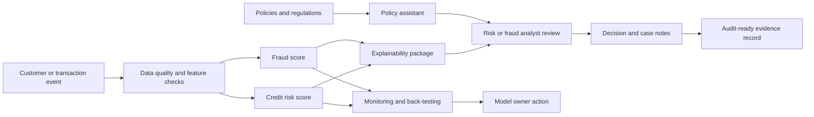
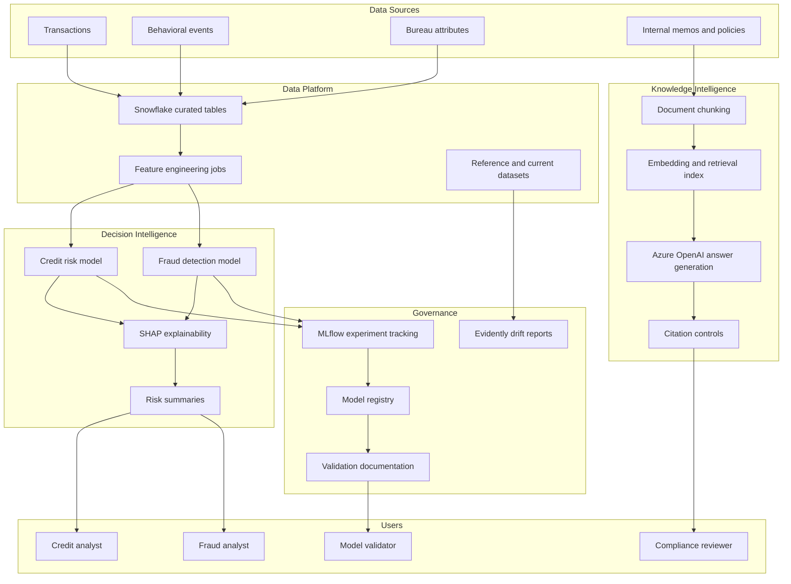
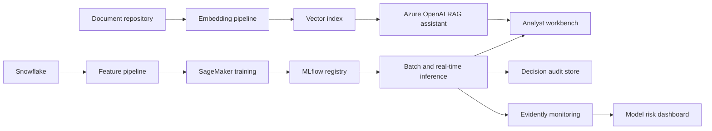

# Business Architecture

## 1. Executive View

The platform supports the credit risk and fraud operating model by connecting data, decision models, analyst workflows, governance controls, and policy knowledge retrieval. It is designed for explainable decisions, controlled model operations, and faster compliance review.

## 2. Capability Map

| Capability | Description | Business Owner |
| --- | --- | --- |
| Credit risk assessment | Estimate default risk and identify early-warning signals. | Credit Risk |
| Fraud detection | Detect suspicious behavioral and transaction patterns. | Fraud Operations |
| Explainability | Show feature rationale for every model decision. | Model Risk |
| Regulatory search | Retrieve citation-backed policy answers. | Compliance |
| Drift monitoring | Detect data and model stability issues. | Model Operations |
| Lifecycle management | Track experiments, artifacts, versions, and approvals. | ML Platform |
| Audit evidence | Preserve decision records and governance documentation. | Audit |

## 3. Business Process Flow

## 4. Logical Architecture

## 5. Data Domains

| Domain | Examples | Governance Notes |
| --- | --- | --- |
| Customer profile | Age band, income, employment years | Sensitive data, access controlled. |
| Bureau risk | Credit score, utilization, delinquencies | Regulated third-party data. |
| Transaction activity | Amount, merchant risk, channel | Used for fraud and credit signals. |
| Behavioral signals | Login velocity, device risk, geo velocity | Requires privacy review and minimization. |
| Model evidence | Scores, features, explanations, metrics | Retained for audit and validation. |
| Policy knowledge | Regulations, standards, internal controls | Citation-backed retrieval required. |

## 6. User Journey

1. A new application or transaction event enters the platform.
2. Feature checks validate that required attributes are present.
3. Credit risk and fraud models generate probability scores.
4. Explainability logic attaches feature rationale to each score.
5. Analysts review high-risk or suspicious cases in priority order.
6. Compliance teams use the policy assistant to confirm required evidence.
7. Decisions, citations, model version, and explanations are stored for audit.
8. Model owners review drift and back-testing results on a scheduled cadence.

## 7. Business Controls

| Control | Purpose |
| --- | --- |
| Feature completeness checks | Prevent scoring on incomplete records. |
| Score threshold routing | Ensure high-risk cases receive human review. |
| Explanation capture | Support fair, transparent, and auditable decisions. |
| Citation requirement | Prevent unsupported regulatory responses. |
| Drift thresholds | Trigger investigation when input populations change. |
| Model registry approval | Prevent unapproved model versions from production use. |
| Evidence retention | Preserve decision support material for audits. |

## 8. Target Operating Model

| Function | Responsibility |
| --- | --- |
| Risk Analytics | Own model development, thresholds, and score interpretation. |
| Fraud Operations | Own alert triage, feedback labels, and false-positive review. |
| Compliance | Own policy corpus, citation standards, and regulatory interpretation. |
| Model Risk Management | Validate methodology, explainability, and performance stability. |
| Data Engineering | Own data quality, feature pipelines, and source integrations. |
| ML Platform | Own deployment, MLflow tracking, SageMaker jobs, and monitoring automation. |

## 9. Production Deployment View

## 10. Current Repository Scope

This repository implements a local, shareable version of the architecture. It uses synthetic data, local model artifacts, local retrieval, and optional integration hooks for Azure OpenAI, MLflow, PySpark, Evidently, and SageMaker.
